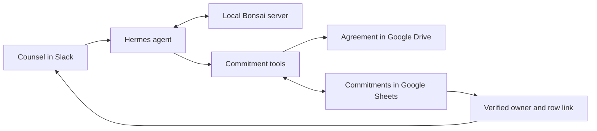

# Assign client commitments from Slack

Ask "What commitments still need an owner?", inspect the agreement behind each obligation, and save an owner to the team's Google Sheet. Counsel can resolve assignments during the weekly review and return to the same conversation when a commitment needs follow-up.

The example includes agreements for facilitation services delivered to clinical AI companies and a clinic network. Its sample register includes deadlines, amendments and obligations whose due dates depend on information the team still needs to supply.

## What the team sees

Counsel asks for unassigned commitments, checks a source clause, then asks to assign a commitment to Khizar. The bot confirms the previous and saved owner and links to the exact Sheet row. In the recorded APL-002 transaction, the owner changed from unassigned to Khizar at revision 1; an independent Google API read verified the result.


The saved owner records responsibility in the register. Acceptance by that person is a separate step in the team's process.

## How an assignment works



Hermes runs the conversation and invokes the permitted tools. Bonsai interprets the request and selects those calls. The tools retrieve the agreement, check the register revision, save the owner and read the saved cells before confirming the update. The [architecture walkthrough](docs/architecture.md) covers storage, credentials, concurrency and failure handling.

A manual review requires counsel to move between the agreement, conversation and register. Here the same records remain authoritative, while the agent brings the source and assignment into Slack. Putting persistence and verification in tools makes the result inspectable independently of the model's wording. A form or spreadsheet remains simpler when the task needs no source interpretation; this pattern is useful when people need to ask follow-up questions before deciding.

## Try the sample register

Python 3.10 or newer is enough to validate the agreements and inspect the initial register:

```sh
git clone https://github.com/ChaiWithJai/bonsai-hermes-legal-workstation.git
cd bonsai-hermes-legal-workstation
python3 scripts/build_seed.py
python3 -c 'import json, commitments; print(json.dumps(commitments.execute("review_commitments", {"unassigned_only": True}), indent=2))'
```

The seed command checks the cited agreement sections and writes the importable commitments CSV. The review prints the unassigned commitments using the local sample register.

Next, follow the [setup guide](docs/setup.md) to install Hermes and the matching Prism runtime, start Bonsai, and create an isolated agent profile. Ask the same weekly-review question, inspect APL-007 and assign its owner. The default setup saves locally; the Google section connects your Sheet and Drive before you enable Slack. Every step includes a way to inspect the saved result.

## Why these model settings

Bonsai supplies the language reasoning and tool selection; the application checks the facts it can verify in code. The reference run uses Ternary Bonsai 2 27B in PQ2_0 format on an M5 Pro with 48 GiB of memory. The model and matching Prism runtime are a reproducible starting point for a workstation deployment.

The [parameter guide](docs/parameter-guide.md) explains temperature, sampling, context, reasoning budget and tool limits, with sources and a task-specific evaluation plan. The settings follow the publisher's thinking-mode guidance. The workflow has been exercised with them, but a controlled comparison has not established an optimal configuration for legal or finance work.


The [configuration record](docs/recorded-configuration.md) identifies the profile and request fields used to produce this reference view.

## Find the code and extend it

| Location | What to change |
| --- | --- |
| `commitments.py` | Register reads, source retrieval, owner writes and verification. |
| `agreements/`, `seed.json`, `commitments.csv` | Sample agreements and register inputs. |
| `SOUL.md`, `hermes-config.json`, `config/` | Agent instructions, tool access and sampling. |
| `scripts/` | Google checks, request capture and the cost worksheet server. |
| `tests/` | Assignment, source and configuration regression checks. |
| `docs/`, `evidence/` | Setup and architecture guides, followed by recorded results. |

Run `python3 -m unittest discover -s tests -v` after changing a tool. Use the [cost worksheet](docs/cost-analysis.md) to compare cost per accepted assignment at your workload, and the [connected verification](docs/google-verification.md) to inspect the Slack and Google evidence.
