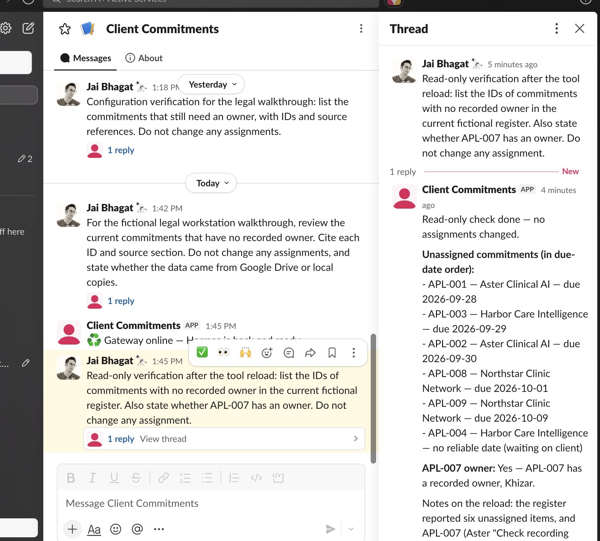
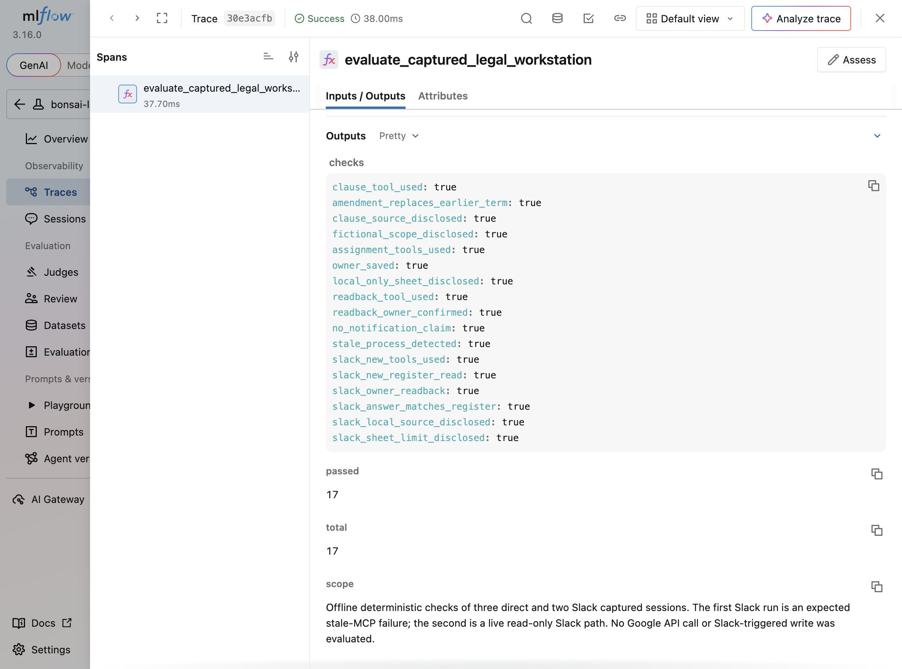

# Legal commitments workstation

Review the commitments that still need an owner, inspect the agreement behind each obligation and assign the next action from Slack. The weekly review gives counsel a way to check responsibility without asking the delivery team to adopt another work queue.

Hermes provides the conversational workflow, and Ternary Bonsai 2 27B runs on your workstation. The tools retrieve clauses and save assignments. The included sample agreements cover facilitation services for clinical AI companies and a clinic network, including an amended retention deadline and an acceptance date that remains unknown.

Start with the local workflow below, then connect your Google Drive and commitments Sheet. The [architecture](docs/architecture.md) describes the tools, storage, network and assignment behavior. The [execution record](EVIDENCE.md) distinguishes recorded runs from integrations still awaiting verification. The [reproduction gist](https://gist.github.com/ChaiWithJai/8d4f27ee997b8ef07a46488a45ea02ae) provides the published command sequence.

## Reproduce the local workflow

1. Install the matching Prism runtime and Ternary Bonsai 2 27B checkpoint using the [Prism Bonsai demo](https://github.com/PrismML-Eng/Bonsai-demo) and [model card](https://huggingface.co/prism-ml/Ternary-Bonsai-2-27B-gguf). Set `LLAMA_SERVER` and `BONSAI_MODEL` to their local paths, then run `sh start_model.sh`. The script binds loopback port 62737 with model alias `bonsai-ui-public-ternary-bonsai2`, 65,536 context tokens, `--jinja`, one slot, and a 512 token reasoning budget. If that port is already in use, check its model ID and launch flags before reusing it.
2. Run `python3 build_seed.py` and `python3 -m unittest discover -s tests -v -p 'test_*.py'`. The first command validates every cited source section and rebuilds the CSV that can be imported into a spreadsheet. The tests use a temporary state file and do not change the demo register.
3. Run `python3 setup.py --profile legal-workstation-demo`. The script creates an isolated Hermes profile and refuses to replace an existing one. Then run `hermes --profile legal-workstation-demo chat --oneshot -Q --run-budget 180 -q "Run the weekly commitments review. Which commitments have no recorded owner?"`.
4. Ask about `APL-007` and its earlier retention term. Then ask, "Assign APL-007 to Khizar, and tell me whether Google Sheets was updated." Ask who owns `APL-007` in a separate turn. The default local register saves the owner in `state.json`; its tool result says `sheet_sync: mocked_local_only`.

The installed profile has three explicit tools, an eight turn limit, medium reasoning, disabled memory and disabled tool search. The tools cannot send a client message or notify an owner. The files `SOUL.md` and `hermes-config.json` show the harness configuration. To DM the agent, supply Slack credentials to a Hermes profile with the same tool configuration; no credentials are included here. The existing A+ Client Commitments app was connected to this repository's tool code for a read-only test on September 26. The first request still used the old cached MCP process after the profile edit. A supervised gateway restart loaded the new tool code, and the second Slack thread correctly read the new register. The captured session and screenshot are in `evidence/`. Those earlier captures were read-only. A subsequent [connected assignment](docs/google-verification.md) read Drive, wrote Sheets and verified the result after a Slack request.

## Use your own Google Drive and Sheet

The six Markdown agreements can be uploaded to a Drive folder. Copy `source-index.example.json` to `source-index.json`, replace each file ID, and set your Sheet ID. Import `commitments.csv` into a tab named `Sheet1`, preserving the column order. The owner column is E, and the revision column is I. The sample Sheet must contain exactly one row per ID.

Set `LEGAL_GOOGLE_TOKEN_FILE` to an absolute path outside the repository before running `setup.py`. The file accepts a plain access token or JSON containing `access_token`; the profile stores only its path, and the tool rereads it on each request. Refresh expired tokens in that file. Automatic OAuth refresh is not implemented. An existing profile needs the same path in the legal MCP server environment and a gateway restart. You can alternatively supply `LEGAL_GOOGLE_TOKEN` in the tool process environment. The token needs read access to the Drive files and read and write access to the Sheet. With a token, the review reads the Sheet, `get_commitment` reads the Drive file through the Drive API, and `assign_owner` checks the Sheet revision before using the Sheets API to update columns E and I. It then reads the Sheet again and verifies the owner and new revision before reporting success. The agent must report `source_kind` and `sheet_sync` from the tool results. Without a token, it uses the local agreement copies and updates only the local register. Google Sheets does not offer an atomic compare and swap for these two cells, so this example should not be used as a concurrent production assignment system.

Run `python3 scripts/check_google.py` to verify the Sheet and each open commitment's Drive clause without making a write. The output records source hashes and revisions without printing credentials. A successful read check does not prove write access; the assignment workflow verifies that separately.

The real demo folder and native Sheet were seeded in the user's personal Google account, but the public source index uses placeholders. This repository does not include the user's OAuth token, private file IDs or personal folder link. The screenshots in `evidence/` show the six Drive documents, populated native Sheet, and live Slack readback. After the model assigned APL-007 in the local register, the owner and revision were entered manually in the Sheet for the filmed state. That historical screenshot does not prove an agent write. The later connected verification records the actual API write and independent readback.

## Evidence and limits

The deterministic tests cover ordering, amendment retrieval, owner persistence, revision rejection and an honest local-only sync result. Live Hermes and Bonsai sessions are exported in `evidence/`, with an MLflow trace of 17 narrow checks over three direct sessions and two Slack sessions, including detection of the stale-MCP failure. Install `requirements-eval.txt` in a separate Python environment, start an MLflow tracking server, set `MLFLOW_TRACKING_URI`, and run `python evaluate.py` there to repeat the offline evaluation. The trace is not a model-wide accuracy result. The finance and ambient demonstrations keep their own evidence rather than borrowing this workstation's results.

For cost comparisons, start with [cost analysis](docs/cost-analysis.md) and `workload_tco.py`. The latter reads observed token counts and model calls from individual requests in a captured session, then requires explicit assumptions for hardware, power, operations, review, volume, acceptance and hosted rates. The older `tco.py` remains a simpler scenario calculator. Neither measures savings from the current demo.

## Observe live tool calls

Install `requirements-eval.txt` into the interpreter used by the MCP server. Before creating a profile, set `LEGAL_PYTHON` to that interpreter, `LEGAL_TRACE=1` and `MLFLOW_TRACKING_URI` to your local server, such as `http://127.0.0.1:5210`. The profile preserves the tracing settings. Existing profiles need the same environment values and a tool-process restart.

Each tool invocation creates a `TOOL` span in the `legal-workstation-demo` experiment with its arguments, output and execution status. Tool results can include agreement text and assignments, so choose the tracking destination accordingly. These spans cover tool execution only. They do not measure model generation, represent a complete Slack transaction or provide a human acceptance decision. The offline evaluation runs remain separate from live tool traces.
