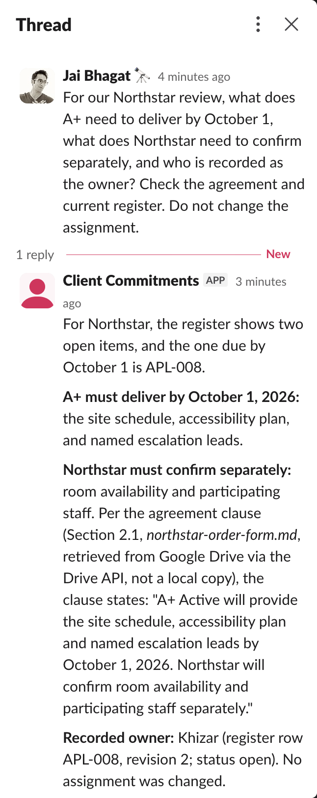
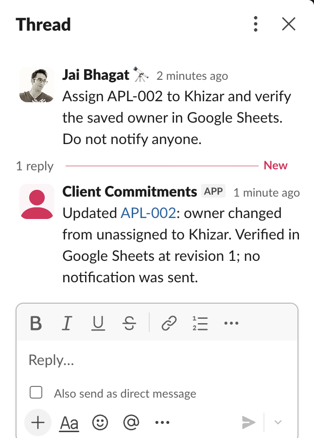

# Connected assignment verification

On September 26, a DM to the Client Commitments bot requested that APL-008 be read from Drive and assigned to Khizar. Hermes called the legal tools through the local Bonsai service. The tools retrieved the agreement through the Drive API, wrote the owner and revision through the Sheets API, and verified the write with a fresh read.

A separate process then read Khizar at revision 1 from Google Sheets. Slack API readback confirmed the bot delivered its response. The response stated that no notification was sent and that recording an owner does not establish that person's acceptance.

The captured session is `20260926_164920_a982cebd`. The [session export](../evidence/slack-google-assignment-session.json), [independent readback](../evidence/slack-google-readback.json) and [delivered reply](../evidence/slack-google-delivery.json) describe one observed transaction. The earlier direct Google assignment of APL-003 to Anthony is a separate run.

The Google access token was supplied through a private local token file. Tokens expire, and automatic OAuth refresh is not implemented. The Sheet revision check is not an atomic concurrency guarantee. These runs establish the sample workflow, not production availability, legal judgment or general reliability.

The saved owner and revision were verified, but the response's description of the obligation needs correction. It called the deliverable Northstar's obligation, while the quoted clause requires A+ Active to provide the schedule, accessibility plan and escalation leads. Northstar separately confirms rooms and participating staff. Successful persistence does not establish correct legal interpretation.

## Register correction

The initial register summary also omitted the accessibility plan and introduced backup contacts that Section 2.1 does not require. On September 26, the local seed and connected Sheet were corrected to identify A+ Active and the three required deliverables. The supporting-evidence field now distinguishes Northstar's separate room and staffing confirmation. Khizar remains the recorded owner, and the Sheet revision advanced from 1 to 2.

The correction was made through the Google Sheets browser interface, then verified after reloading the page. The [cell readback](../evidence/northstar-register-correction.json) records that maintenance operation separately from the earlier agent assignment. The API credential returned HTTP 401 during this check; a fresh Slack transaction still requires restored API access and verification of the model's answer.

Google API access was subsequently restored using the existing demo account authorization. The [renewed read check](../evidence/google-access-renewed.json) retrieved all seven open commitments from Sheets and each supporting clause through Drive, including APL-008 at revision 2. That check made no writes and does not establish a new Slack or model result. Automatic token refresh remains unimplemented.

## Corrected client review

A fresh Slack question asked what A+ owed by October 1, what Northstar needed to confirm separately, and who owned the work. The first replay after updating the profile searched only unassigned commitments and substituted the unrelated quarterly review. The lookup now includes assigned commitments by default, while the weekly owner review explicitly requests unassigned records. The result identifies which filter was applied.

The [repaired reply](../evidence/slack-assigned-lookup-repaired.json), session `20260926_210628_2e6332fa`, correctly returned APL-008, all three A+ deliverables, Northstar's separate confirmations, and Khizar at register revision 2. Its delivery was verified in the Slack thread. No assignment changed during that request. The [failed reply](../evidence/slack-assigned-lookup-failure.json) remains available for comparison.

All 22 deterministic tests passed, including a regression proving assigned records remain visible in a client lookup. The [MLflow review record](../evidence/slack-lookup-mlflow.json) links the saved responses. Human acceptance remains pending; the artifact review run does not measure model latency.

The image is a direct browser capture of the reply panel. The full window capture remains in the private presentation assets.

## Weekly review followed by assignment

A later live Slack question, "What commitments still need an owner?", returned APL-001, APL-002, APL-009 and APL-004 in date order with undated work last. An independent Google read matched those four rows. The [weekly reply](../evidence/slack-weekly-current.json) retains its remaining wording issues about relative dates and Harbor's dependency.

The next Slack request asked the agent to read APL-001 and assign its facilitation plan to Anthony without notifying anyone. The agent read the Drive clause and saved Anthony at register revision 1. An independent API read confirmed the owner and revision, and a subsequent unassigned query returned only APL-002, APL-009 and APL-004. The [assignment record](../evidence/slack-anthony-assignment.json) preserves the answer and independent readback. The [MLflow artifact review](../evidence/slack-weekly-assignment-mlflow.json) links both requests. Human acceptance remains pending.

## Slack transaction receipts

Assignment tools now return a two-sentence receipt with the previous owner, saved owner, verified register revision and a link to the affected Sheet row. The bot is instructed to use that receipt without appending the agreement text or tool diagnostics. An unchanged assignment has a separate receipt saying that no update was needed. Row links use the configured `spreadsheet_gid` and cell range; a browser check verified that the link selects APL-001's row.

The [live short receipt](../evidence/slack-short-receipt.json), session `20260926_212555_ac26ae1b`, changed APL-002 from unassigned to Khizar. A separate Google API read verified Khizar and revision 1. Slack rendered APL-002 as a clickable Sheet row link within the two-sentence reply.

The [connected capture evaluation](../evidence/connected-review-evaluation.json) records all three related sessions in MLflow experiment 44. It checks the saved tool sequence, independent readbacks, responsible parties and receipt. The first Northstar answer passes the write checks but fails the party and deliverables check; the corrected read-only reply passes that narrow check. Run `scripts/evaluate_connected_review.py` with an MLflow-enabled Python environment to reproduce the artifact review. The trace reviews saved records and does not contain the live model spans or human approval.

