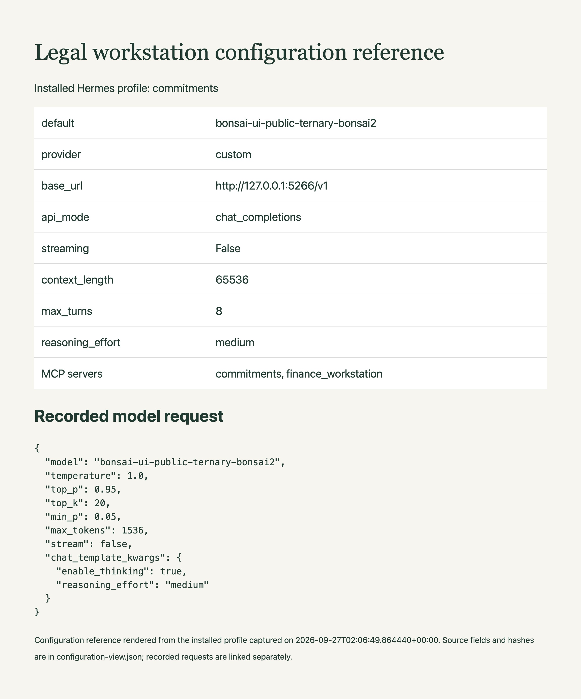

# Inspect the model and Hermes configuration

The image is a configuration reference rendered from selected fields in the installed `commitments` profile. The [source record](../evidence/configuration-view.json) records the capture time and profile hash. This snapshot was captured after the runs; use the linked HTTP exchanges to inspect settings applied to a recorded request.

Create an isolated profile with the repository setup command, then inspect its model endpoint and MCP tool paths before starting the gateway or scheduler. Setup templates and the installed profile can differ. A service using an existing profile must reload after its configuration changes.

Use the launch guide to match the GGUF and runtime build, then inspect the recorded HTTP request for the effective sampling values.

The source record includes the applied model request settings from session `20260926_212555_ac26ae1b`, with the exchange identifier and source hash.
